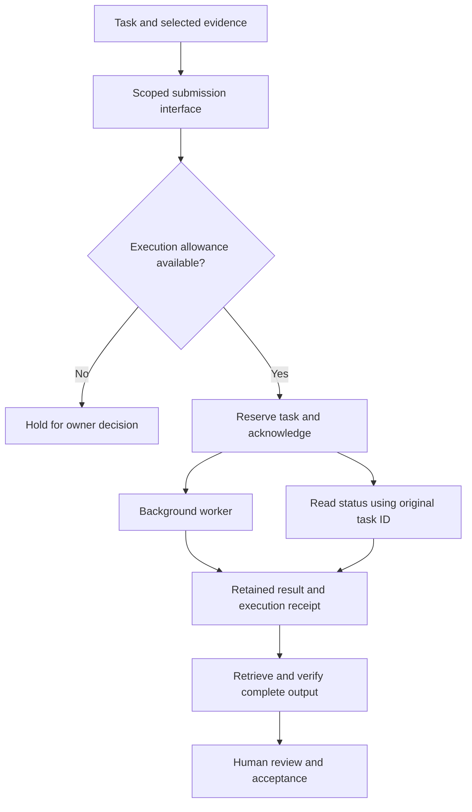

# Governed AI Workflow Orchestration

**Turn AI access into a repeatable delivery process with explicit authority, recoverable execution, and measurable economics.**

EDC Chief / node01 · Internal development milestone through September 19, 2026

## Business problem

AI-assisted work loses value when a person must repeatedly move prompts and results between tools, determine whether a timed-out request actually ran, and reconstruct what happened. More automation can also create more supervision if approvals, recovery, and review are poorly designed.

I am building an operating workflow that connects task definition to authorized execution, verified retrieval, and human acceptance. My role spans the business requirements, architecture, execution boundaries, and evaluation criteria, with AI-assisted implementation and troubleshooting.

## Architecture demonstrated at this milestone

This shows the authorized draft-delivery path. It does not represent an unrestricted agent, a multi-provider scheduler, or permission to execute recommendations contained in a draft.

| Architecture decision | Business and operating value |
|---|---|
| Submit work through a reusable interface | Removes manual prompt/result relay between sessions for the demonstrated tasks. |
| Acknowledge before generation completes | Keeps a long-running task from depending on a synchronous connection remaining open. |
| Retain the original task identity after an uncertain response | Allows status reconciliation without creating a duplicate submission. |
| Bound execution with an explicit allowance | Separates permission to run a task from an agent's ability to propose more work. |
| Verify complete output against recorded hashes | Detects incomplete or altered retrieval before review; integrity does not establish factual correctness. |
| Separate completion from acceptance | Prevents generated drafts from being counted as successful business outcomes automatically. |

## A concrete recovery lesson

The first reusable-inbox submission returned a transport timeout even though the worker continued. Reading status and results under the original task ID recovered the completed output without resubmission. A subsequent revision separated acknowledgement from generation. Its live check returned a running acknowledgement in **6.618 seconds**, completed the worker run in **119.476 seconds**, and delivered the final result **131.966 seconds** after submission.

These are observations from different tasks and revisions, not a controlled performance comparison. The improvement demonstrated is the acknowledgement behavior and successful retrieval, not a general latency or productivity guarantee.

## Observed delivery evidence

Three internal drafts were completed and retrieved across two execution checks. Each was submitted once, with no task retries; completion records document output-integrity verification.

| Draft | Receipt duration | Submission to final retrieval | Reported tokens | Human accepted at checkpoint |
|---|---:|---:|---:|---|
| Integration brief | 119.865 seconds | 205.379 seconds | 17,357 | No |
| Proposed website copy | 83.978 seconds | 115.620 seconds | 12,071 | No |
| Pilot intake and evaluation rubric | 119.476 seconds | 131.966 seconds | 13,676 | No |

The [machine-readable execution summary](../evidence/governed-ai-execution-summary.json) retains exact measurements and their scope. It is a sanitized derivative of internal completion records, not a raw runtime receipt or independently reproducible benchmark. Operational identifiers, source content, infrastructure details, and raw logs are omitted.

## Economics and next validation

The three runs reported **43,104 tokens**: 35,039 input and 8,065 output. Cached input is included in the input total. Actual served model, billing pool, and monetary cost were unavailable.

The first two runs also required an owner-estimated **5–7 approvals and 1–5 intervention minutes**, excluding setup and later output review. That friction matters: removing manual relay does not establish zero-touch operation. A recovery instruction in one draft required correction before implementation.

The next business test is whether this workflow delivers accepted work with less total human effort. Measure preparation, approvals, intervention, review, and rework alongside execution cost and acceptance quality. At this checkpoint, accepted outcomes were zero, so **cost per accepted outcome remained undefined**.

The demonstrated foundation is a reusable, bounded draft-delivery loop. The next priorities are simpler maintenance and authorization, followed by evaluating useful work under a practical operating allowance. Broader worker routing and unattended operation remain outside this milestone. No client savings or production-scale results are claimed.
