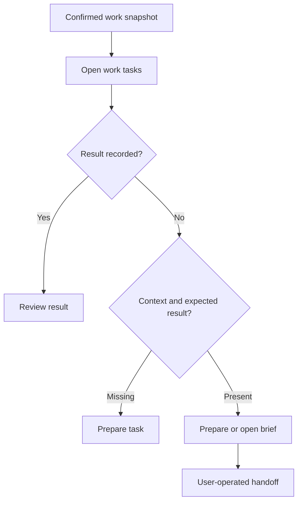

# QUICKDRAW

**Make AI-assisted work economically useful and operationally accountable.**

## Business problem

More model access does not automatically produce more useful work. An available allowance can be spent on a poorly specified task; a high-priority task can lack required context; a completed model response can still require substantial review or rework. Token cost alone misses these labor costs.

QUICKDRAW applies a FinOps perspective to AI-assisted work: identify the next useful action, make its evidence and authority explicit, and evaluate the cost of an accepted outcome.

## Implemented preparation component

The [included function](../examples/quickdraw/quickdraw-work.ts) is extracted from the EDC control plane. It filters eligible work records, orders them by priority and due date, and explains whether the user should prepare a task, open a brief, or review a returned result.

| Implemented choice | Why it matters |
|---|---|
| Exclude personal, sample, non-task, and completed records | Keep the recommendation within the intended work scope. |
| Require context and an expected result even when marked ready | A status label cannot substitute for a usable brief. |
| Keep returned results visible for review | A generated response is not yet an accepted outcome. |
| Suppress recommendations when the snapshot is unconfirmed | Avoid presenting uncertain state as actionable evidence. |
| Always return `dispatchAuthorized: false` | Preparation readiness does not grant permission to execute. |

Run `node examples/quickdraw/demo.mjs` to inspect these states with synthetic inputs. This component is intentionally small and has no provider, database, clock, or execution side effects.

## Product direction: capacity-aware routing

The broader design would combine connected work signals, remaining allowances, reset timing, protected capacity, task suitability, and uncertainty. One decision authority would revalidate the evidence and permission immediately before an allowed action. Uncertain execution would require reconciliation before retrying.

This routing capability is direction, not functionality demonstrated by the included component. The initial product tradeoff is to retain a manual fallback and avoid a second scheduler or recurring task-metadata burden.

## Business value and measurement

**Cost per accepted outcome = (model and infrastructure cost + preparation labor + review labor + rework labor) ÷ accepted outcomes.**

The objective is to improve that measure while preserving quality and authority. For step-level routing, compare whole-workflow execution with selective routing under the same acceptance criteria; include handoff and coordination overhead. Spare subscription capacity is useful only when the resulting work is worthwhile.

My contribution connects enterprise workflow design, product prioritization, and AI economics: choose where automation is worth the effort, define the handoff, and make the result measurable. Savings and autonomous dispatch are not claimed for this preparation component.
