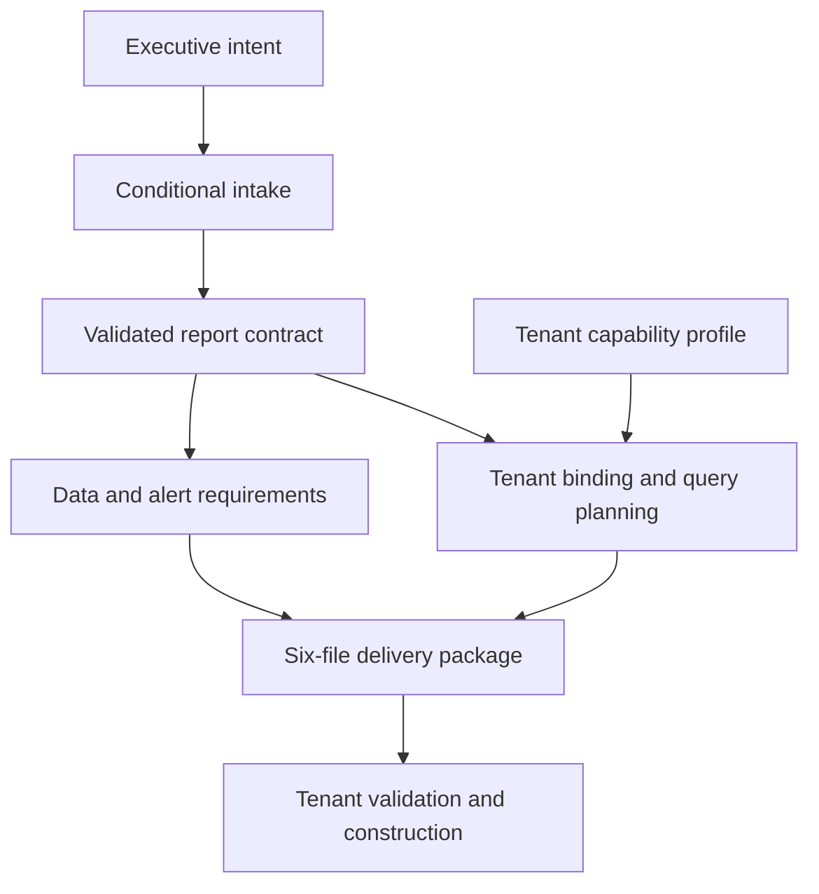

# FinOps Report Architect

**Convert repeated consulting effort into a reusable reporting workflow.**

## Business problem

In enterprise FinOps advisory, report creation can become an expensive cycle of discovery calls, dashboard drafts, stakeholder feedback, and revisions. Consultants, technical account managers, customer success teams, and client stakeholders all contribute labor. A technically correct dashboard can still miss the business decision, its accountable owner, or the data required to act.

I designed Report Architect to capture that expertise in a structured workflow. The product starts with what the audience needs to decide and translates the answers into an implementation package that another practitioner can inspect and use.

## Product and architecture decisions

The current MVP concentrates on executive AWS cost reporting. Its conditional interview captures selected outcomes, comparison baselines, organizational scope, accountability, data dependencies, materiality, presentation, and alert requirements. Revising an answer invalidates dependent answers while preserving unrelated work.

| Decision | Business reason | Technical implementation |
|---|---|---|
| Start with outcomes | Avoid building a dashboard before agreeing what action it enables. | Conditional questions map to report modules and an explicit decision. |
| Separate budget, forecast, and prior period | Avoid misleading financial comparisons and later rework. | Independent baseline plans, common-grain requirements, and module-specific rankings. |
| Separate requirements from tenant configuration | Reuse the design across environments without assuming identical fields. | A portable contract binds logical dimensions and metrics to a capability profile. Missing bindings stop planning. |
| Deliver a usable manual path | Preserve implementation value when automated report creation is unavailable. | A manifest and exact build guide accompany the contract, rationale, trace, and validation results. |
| Verify the complete handoff | Detect changed files and mixed report packages before consumption. | Six-file integrity verification and cross-file interview/contract identity checks. |

The reporting core uses deterministic rules. AI-assisted development helped build the product; an LLM does not silently invent financial requirements inside the report compiler.

## Inspect a concrete example

The [synthetic package](../examples/report-architect/fixtures/output-package/report-rationale.md) asks an executive to approve corrective action on material AWS cost changes. It specifies a 10% or $20,000 threshold, independent budget/forecast/prior-period comparisons, an accountable owner, and the required CMDB and business-KPI inputs. These are demonstration inputs, not client results.

Run `node examples/report-architect/demo.mjs` to verify that package and reproduce its query plan. The included source proves field binding, separate baseline handling, read-only query definitions, and package integrity. The full interview engine and renderer remain in the working repository.

## Business value and measurement

The commercial opportunity is to reduce the labor required for each accepted report design, increase the number of clients an advisory team can support, and shorten the path from onboarding to a useful decision. Structured intake also records user priorities and missing data that can inform implementation and product decisions.

**Capacity released = accepted report designs × reduction in combined consultant and client hours per design.**

Track discovery, construction, revision, and review time separately. Compare equivalent use cases, count rejected outputs and rework, and include intake and maintenance effort. Convert recovered hours to cash savings only when spending is actually avoided; otherwise report additional delivery capacity.

Current evidence supports a working design-and-package capability with synthetic validation. The next business validation is a controlled tenant pilot measuring time to an accepted report, revision cycles, and whether the report supports the intended action. Tenant execution, automated saved-report creation, and realized labor savings are not established by this showcase.
